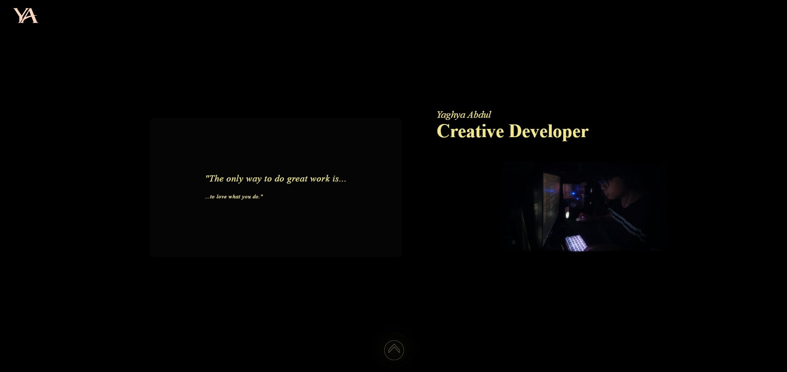
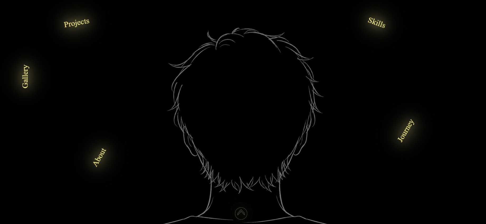
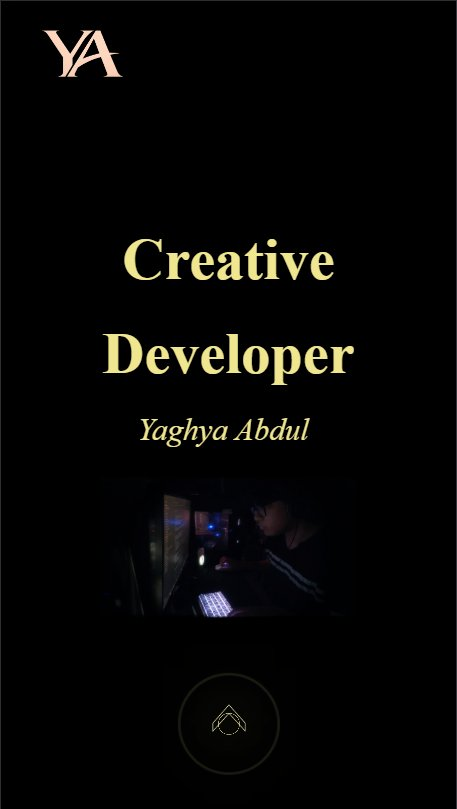

# HTML-CSS-Portfolio

A personal portfolio website built with HTML and CSS as a final showcase project for a beginner web development course.

---

## Purpose

This website was built to demonstrate the HTML and CSS concepts learned during training. It introduces who I am, highlights my skills and interests, and documents my learning journey as a beginner developer.

---

## Features

- Hero / welcome section
- About Me section
- Skills section
- Projects section
- Education & Learning Journey section
- Gallery & Interests section
- Goals & Achievements section
- Contact form
- Consistent colour palette and personal design style
- Responsive layout using Flexbox / CSS Grid
- Mobile-friendly design with media queries

---

## HTML Concepts Used

- HTML document structure (`DOCTYPE`, `html`, `head`, `body`)
- Semantic elements (`header`, `nav`, `main`, `section`, `footer`)
- Headings and paragraphs
- Links and images with alt text
- Lists (ordered and unordered)
- Tables
- Forms with labels and input fields
- Buttons
- Meta tags
- Comments and clean indentation

---

## CSS Concepts Used

- External stylesheet
- Selectors, classes, and IDs
- Colours and fonts
- Box model (margins, padding, borders)
- Backgrounds and text styling
- Image styling
- Hover effects
- Flexbox and CSS Grid
- Responsive design with media queries
- Consistent spacing and layout
- Transitions and animations (bonus)

---

## How to View the Project

**Option 1 — Live site:**  
[View on GitHub Pages](https://newmi-git.github.io/HTMl-CSS-Portfolio/)

**Option 2 — Run locally:**
1. Clone the repository:
   ```bash
   git clone https://github.com/Newmi-Git/HTMl-CSS-Portfolio.git
   ```
2. Open `index.html` in your browser.

---

## Folder Structure

```
html-css-portfolio/
├── index.html
├── about.html
├── projects.html
├── contact.html
├── gallery.html
├── skills.html
├── journey.html
├── css/
│   └── style.css
├── CV
├── Templates
├── images/
└── README.md
```

---

## Screenshots

**Hero Section (Desktop)**


**Navigation Menu**


**Mobile View**


---

## Challenges Faced

Working with mutiple forms really made it challenging for navigation as well as finding more creative ways to use CSS to implement the creative ideas i had in my head.

---

## What I Learned

I learnt that some languages like CSS, can really be utilized in a different way to do things u couldnt imagine. Although i dont
plan on using it much in the future, it showed me the potential different coding languages have depending on how you utilize it.

---

## Future Improvements

- Add JavaScript for interactivity (e.g. a working contact form, dark mode toggle)
- Expand the projects section as I build more work
- Further improve mobile responsiveness
- Deploy and maintain updates via GitHub Pages

---

## Author

**Yaghya Abdul**  
GitHub: [github.com/Newmi-Git](https://github.com/Newmi-Git)  
LinkedIn: [linkedin.com/in/yourprofile](https://www.linkedin.com/in/yaghya-abdul-b85aa1346/) ← *replace with your actual link*

---

*Built as part of an HTML & CSS beginner showcase project.*
